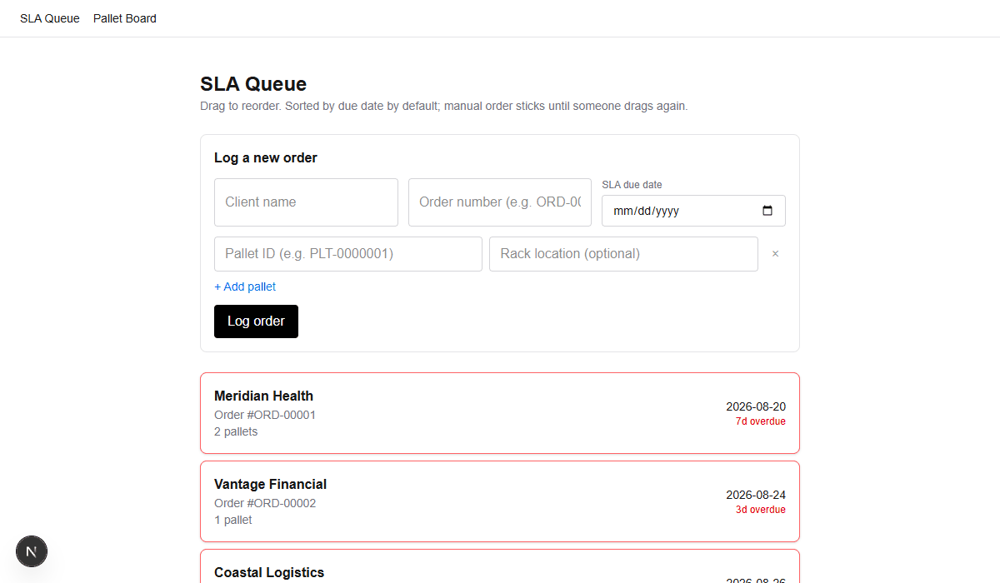

# SortFlow

Internal tools for the sort team at an IT asset disposition (ITAD) warehouse.

## Why this exists

Right now, one person on the sort team manually tracks incoming orders and their SLA due dates in a spreadsheet, and the rest of the team references it to decide what to work on next. That spreadsheet is the single point of failure this project replaces: SortFlow is a live, shared tool the whole team can see and update in real time instead.

It's a solo portfolio project built against a real workplace's actual workflow (seeded/fake data only, no real company data), with the eventual goal of pitching something like it internally once it's proven out. It's explicitly an **accessory app** — it complements the sort team's existing scanning/tracking system rather than replacing it, and it's scoped to the sort team only (not the downstream audit team).

**Live demo:** [sortflow-paloalto.vercel.app](https://sortflow-paloalto.vercel.app) — password `PaloAlto`. Seeded/fake data only.

## See it in action



This is the whole loop end to end, captured against the app actually running (not mocked):
1. A low-urgency order gets dragged to the top of the SLA queue, overriding the default due-date sort
2. Clicking over to the Pallet Board shows that order's pallets auto-staged themselves, while the order that lost the #1 spot has its untouched pallets fall back to Backlog
3. A sorter drags one of those newly-staged pallets into In Progress
4. Back in the SLA queue, the original top order reclaims #1 — and back on the Pallet Board, the pallet already In Progress **stays exactly where it is**, while the other still-staged pallet reverts to Backlog. Reprioritizing never disturbs work someone's already started.
5. A sorter finishes a pallet and drags it into Completed — it stays put and the order stays active, since it still has another pallet outstanding. (Complete every pallet on an order and the order archives itself off both boards automatically — not shown in the clip above, but see the Pallet Kanban Board section below.)

## What's implemented

**SLA Queue** (`/`) — the flagship feature.
- Log a new order: client name, order number, SLA due date, and one or more pallet IDs
- Work queue sorted by priority, with drag-and-drop manual reordering that sticks for everyone until someone drags again (it doesn't silently revert to due-date order)
- Built with optimistic UI, so a drag reorders instantly while the change saves in the background

**Pallet Kanban Board** (`/pallets`) — tracks each pallet through `backlog → staged → in_progress → completed`.
- Only the #1 priority order's pallets auto-promote to `staged`; if an order loses the #1 spot, its untouched staged pallets fall back to `backlog` (anything already in progress or completed is never touched)
- Once every pallet on an order is completed, the order is archived and disappears from both boards automatically
- Sorters can still drag any card to any column manually at any time — the automation just sets a sensible default

Both pages talk to a FastAPI backend backed by Postgres, and both have been manually verified end-to-end in a real browser (not just unit-tested).

**Light/dark mode** — a toggle in the nav and on the login page, defaulting to the system preference and persisting across visits.

**Real-time updates** — the SLA queue and Pallet Board update live for everyone looking at them, not just the person who made the change. A lightweight WebSocket tells connected browsers when something changed; they refetch through the same authenticated path as a normal page load, so no order/pallet data ever travels over that connection itself.

## Tech stack

| Layer | Choice |
|---|---|
| Frontend | Next.js (TypeScript, Tailwind, App Router) |
| Backend | FastAPI |
| Database | Postgres (Docker Compose locally; Supabase in production) |
| Backend hosting | Docker Compose locally; [Railway](https://railway.app) in production |
| Drag-and-drop | [@dnd-kit](https://dndkit.com/) |
| Testing | pytest (backend) |
| Orchestration | Docker + Docker Compose — deliberately no Kubernetes, overkill for this scale |

The frontend isn't containerized on purpose — it runs locally via `npm run dev` so hot reload stays fast, while the backend and database run in Docker.

## Getting started

**Prerequisites:** Docker + Docker Compose, Node.js (a recent LTS), and `git`.

```bash
git clone <this repo>
cd SortFlow
```

Create `frontend/.env.local`:
```
BACKEND_URL=http://localhost:8000
SITE_PASSWORD=<pick a password>
BACKEND_API_KEY=dev-local-api-key
NEXT_PUBLIC_BACKEND_WS_URL=ws://localhost:8000/ws
```
`SITE_PASSWORD` gates the whole app behind a single shared password (no per-user accounts) — you'll land on `/login` until you enter it. `BACKEND_API_KEY` is a separate, service-to-service secret the frontend sends on every backend request; its value must match `BACKEND_API_KEY` in `docker-compose.yml` (already set to `dev-local-api-key` there for local dev — change both together if you customize it). `NEXT_PUBLIC_BACKEND_WS_URL` is the one env var the browser itself reads directly (hence the `NEXT_PUBLIC_` prefix) — it powers real-time updates and doesn't need to match anything else, since it carries no sensitive data.

Install frontend dependencies, then start everything with one command from the repo root:
```bash
npm install --prefix frontend
npm run dev
```
This brings up the backend + Postgres in Docker (detached), then runs the frontend dev server in the foreground at [localhost:3000](http://localhost:3000). The backend is reachable directly at [localhost:8000](http://localhost:8000) (`/docs` gets you the interactive FastAPI Swagger UI).

Other useful commands, all run from the repo root:
```bash
npm run seed          # seed the SLA queue with realistic demo orders
npm run test:backend  # run the backend test suite
npm run logs           # tail backend logs
npm run down           # stop the backend + database containers
```

## Deployment

Target stack: **Vercel** (frontend) + **Railway** (backend) + **Supabase** (Postgres). Same codebase as local dev — only the env vars change, since both frontend and backend already read connection details from environment variables rather than hardcoding `localhost`.

1. **Supabase** — create a project, then grab the Postgres connection string from Settings → Database → Connection string (URI format). Schema is managed by Alembic (`backend/alembic/`), which runs automatically (`alembic upgrade head`) before the app starts — no manual migration step needed for a first deploy against a fresh database, and future schema changes ship the same way.
2. **Railway** — create a service from this GitHub repo with the root directory set to `backend/`; Railway detects the `Dockerfile` automatically. Set three env vars:
   - `DATABASE_URL` — the Supabase connection string from step 1
   - `BACKEND_API_KEY` — a long random secret (e.g. `openssl rand -hex 32`), **not** the `dev-local-api-key` value used locally
   - `ENVIRONMENT=production` — turns off the public `/docs`, `/redoc`, and `/openapi.json` routes (left on by default for local dev)

   Railway injects its own `PORT` env var at runtime; the Dockerfile's `CMD` already binds to it (falling back to `8000` when unset, which is what local `docker-compose` uses). After the first deploy, note the public Railway URL — the frontend needs it next.
3. **Vercel** — import this repo with the root directory set to `frontend/`. Set:
   - `BACKEND_URL` — the Railway URL from step 2
   - `BACKEND_API_KEY` — must match Railway's value from step 2 exactly, or every backend request gets a 401
   - `SITE_PASSWORD` — a real password, not the `sortflow-dev` value used locally
   - `NEXT_PUBLIC_BACKEND_WS_URL` — the Railway URL from step 2, but as `wss://` instead of `https://` and with `/ws` appended (e.g. `wss://your-app.up.railway.app/ws`)

None of `BACKEND_API_KEY`/`SITE_PASSWORD` should reuse their local-dev values in production — pick new ones when deploying. (`NEXT_PUBLIC_BACKEND_WS_URL` isn't a secret — it's sent to every visitor's browser by design.)

## Testing

Backend logic — the SLA queue's position math and the pallet Kanban board's auto-stage/revert/archive cascade — is covered by a pytest suite in `backend/tests/`, run via `npm run test:backend`. Tests run against an isolated temp-file SQLite database (never the real dev data), and include regression coverage for at least one real bug caught during manual testing.

There's no frontend test framework set up yet; UI changes are verified manually in a real browser instead.

## Project structure

```
backend/
├── app/
│   ├── main.py
│   ├── database.py
│   ├── models/          # SQLAlchemy models, one file per tool
│   ├── schemas/          # Pydantic schemas, one file per tool
│   ├── staging.py        # shared SLA-priority-driven pallet staging logic
│   └── routers/          # one router per tool
├── tests/
├── scripts/seed.sh       # demo data seed script
└── Dockerfile

frontend/
├── app/                  # Next.js App Router pages
├── components/
└── lib/                  # shared types, API calls, and Server Functions
```

The backend is deliberately modular — each tool (SLA queue, pallet Kanban, and whatever comes next) owns its own models/schemas/router, so new tools can be added without touching existing ones. `staging.py` is the one intentional exception: pallet staging is defined entirely in terms of SLA queue priority, so that logic is shared rather than duplicated.

## Roadmap

- **Model lookup tool** — an AI agent that looks up an unfamiliar asset's model number and determines whether it's above or below the resale cutline, grounded in the team's actual cutline spreadsheet and reference documents. Currently being scoped as a Microsoft Copilot Studio agent rather than in-repo code, so it won't show up in this codebase directly.
- An **outbound pallet board + warehouse floor map** were previously built (including an interactive pan/zoom floor plan) and then deliberately reverted — not pursued for now. If revisited, it'll be re-scoped from scratch rather than restored from git history.

## License

MIT — see [LICENSE](LICENSE).
